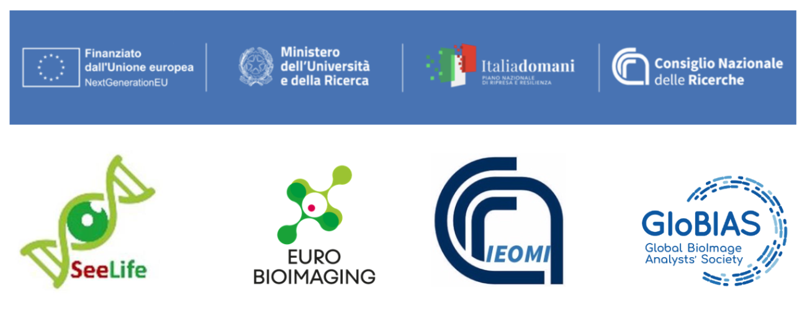
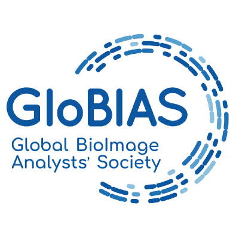

  

# Fluorescence image analysis course
<b>Introductory Course on BioImage Analysis for Microscopy - GloBIAS & CNR Naples 2025</b>

<b>7-11 July 2025 </b> 
Consiglio Nazionale delle Ricerche (CNR)
Istituto degli endotipi, in oncologia, metabolismo e immunologia (IEOMI)
"G. SALVATORE"
Naples (Italy)

Local organizers:
<b>Domenico Russo, Simone Di Paola, Seetharaman Parashuraman (CNR, Naples)
</b>
<table>
<td width=100%> 

This training is developed and delivered by <a href="https://github.com/RoccoDAnt">Rocco D’Antuono</a> (The Francis Crick Institute, London, UK), <a href="https://github.com/StojiljkovicVetAna">Ana Stojiljkovic</a> (University of Bern, Switzerland), <a href="https://github.com/sebgoti">Sebastian Gonzalez Tirado</a> (Heidelberg University, Germany), <a href="https://github.com/Daniel-Waiger">Daniel Waiger</a> (Hebrew University of Jerusalem, Rehovot, Israel). 
</td>
</table>
 

Learning outcomes:
at the end of the course, trainees will be able to describe the basic concepts of fluorescence image formation and bioimage analysis, quantify shape and fluorescence intensity of cells and organelles, measure colocalization, measure spatial relationships between classed of objects, track objects in 3D, render image data sets in 3D for animations, run basic 3D segmentation, create basic plots to show results, prepare figures for scientific publications.

The course will include talks, practical sessions, and project work on trainees own data or test data sets from public image databases.

## Programme:
### Day 1
Monday 7th July 2024
#### Introduction & Basics of Image Analysis

|<b>Time</b>| <b>Topic</b>|
|---| ---|
|08:30-09:00| Introduction to the course - Domenico Russo, Simone Di Paola, Seetharaman Parashuraman|
|09:00-09:30| Participants self introduction - All Trainers and Trainees|
|09:30-10:30| Image formation in fluorescence microscopy- Rocco D'Antuono|
|10:30-11:00| Coffee break|
|11:00-12:00| Introduction to bioimage analysis - Rocco D'Antuono|
|12:00-13:00| Lunch |
|13:00-14:00| Introduction to FIJI - Daniel Waiger|
|14:00-15:00| Showcase of FIJI plugins for bioimage analysis - Ana Stojilkovic and Daniel Waiger|
|15:00-15:30| Coffee break|
|15:30-17:00| Project working groups with own data or test data - Ana Stojilkovic and Rocco D'Antuono|
|17:00-17:30| Progress report on project work - How to do better? - All the trainers|
|18:00| Dinner|
|---|---|

### Day 2
Tuesday 8th July 2024
#### Advanced Image Processing

|<b>Time</b>| <b>Topic</b>|
|---| ---|
|09:00-09:30| Progress check on project work and trainees' expectations|
|09:30-10:30| Automatisation of bioimage analysis with ImageJ macro powered by large language models- Daniel Waiger |
|10:30-11:00| Coffee break|
|11:00-12:00| ImageJ macro practical session - Ana Stojiljkovic and Daniel Waiger|
|12:00-13:00| Lunch |
|13:00-14:00| TrackMate for cell and organelle tracking - Sebastian Gonzalez Tirado|
|14:00-15:00| Tracking hands-on session - Sebastian Gonzalez Tirado and Rocco D'Antuono|
|15:00-15:30| Coffee break|
|15:30-17:00| Project working groups with own data or test data - Daniel Waiger and Sebastian Gonzalez Tirado|
|17:00-17:30| Progress report on project work - How to do better? - All the trainers|
|18:00| Dinner|
|---|---|

### Day 3
Wednesday 9th July 2024
#### Batch analysis of large data sets

|<b>Time</b>| <b>Topic</b>|
|---| ---|
|09:00-09:30| Progress check on project work and trainees' expectations|
|09:30-10:30| CellProfiler pipelines for the analysis of HCS data - Ana Stojiljkovic |
|10:30-11:00| Coffee break|
|11:00-12:00| CellProfiler practical session - Ana Stojiljkovic and Rocco D'Antuono|
|12:00-13:00| Lunch |
|13:00-14:00| CellProfiler Analyst to visualise and plot image analysis results - Ana Stojiljkovic and Sebastian Gonzalez Tirado|
|14:00-15:00| CellProfiler Analyst hands-on session - Sebastian Gonzalez Tirado and Daniel Waiger|
|15:00-15:30| Coffee break|
|15:30-17:00| Project working groups with own data or test data - Rocco D'Antuono and Ana Stojilkovic|
|17:00-18:00| Progress report on project work - How to do better? - All the trainers|
|18:00| Dinner|
|---|---|

### Day 4
Thursday 10th July 2024
#### 3D Segmentation and figure preparation

|<b>Time</b>| <b>Topic</b>|
|---| ---|
|09:00-09:30| Progress check on project work and trainees expectations|
|09:30-10:30| napari for 3D rendering and segmentation - Rocco D'Antuono |
|10:30-11:00| Coffee break|
|11:00-12:00| napari for 3D segmentation - practical session - Rocco D'Antuono and Sebastian Gonzalez Tirado|
|12:00-13:00| Lunch |
|13:00-14:00| Figure preparation with FIJI and Inkscape- Rocco D'Antuono|
|14:00-15:00| Project working groups with own data or test data - Sebastian Gonzalez Tirado and Ana Stojilkovic|
|15:00-15:30| Coffee break|
|15:30-16:00| Project working - Conclusions - All the Trainers|
|16:00-17:00| Trainees presentation on own project work |
|17:00-17:30| Wrap up on the use of open-source for bioimage analysis- All the trainers|
|18:00| Dinner|
|---|---|

### Day 5
Friday 11th July 2024
#### Introduction to ZEISS arivis Advanced Image Analysis
