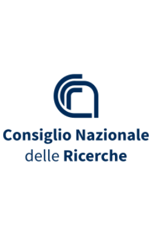

  
  

# Introductory Course on BioImage Analysis for Microscopy - GloBIAS -CNR Naples 2025
Introductory Course on BioImage Analysis for Microscopy - GloBIAS -CNR Naples 2025

7-10 July 2025  
Consiglio Nazionale delle Ricerche (CNR)
Istituto degli endotipi, in oncologia, metabolismo e immunologia
"G. SALVATORE"
Naples (Italy)

Local organizers:
Domenico Russo, Simone Di Paula, Seetharaman Parashuraman (CNR, Naples)

This training is developed and delivered by [Rocco D’Antuono](https://github.com/RoccoDAnt) (The Francis Crick Institute, London, UK), [Fabrice Cordelières](https://github.com/fabricecordelieres) (Bordeaux Imaging Center, France).
Additional trainers: [Ana Stojiljkovic](https://github.com/StojiljkovicVetAna) (University of Bern, Switzerland), [Sebastian Gonzalez Tirado](https://github.com/sebgoti) (Heidelberg University, Germany), [Daniel Waiger](https://github.com/Daniel-Waiger) (Hebrew University of Jerusalem, Rehovot, Israel).

## Program in short:
### Day 1
Monday 7th July 2024
#### Introduction & Basics of Image Analysis

### Day 2
Tuesday 8th July 2024
#### Advanced Image Processing

### Day 3
Wednesday 9th July 2024
#### 3D Tracking & Quantification

### Day 4
Thursday 10th July 2024
#### Automation & Customization
